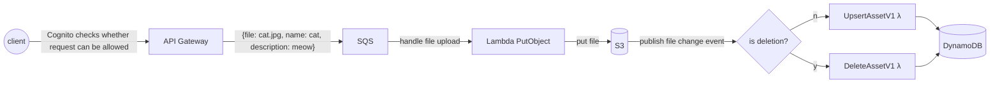
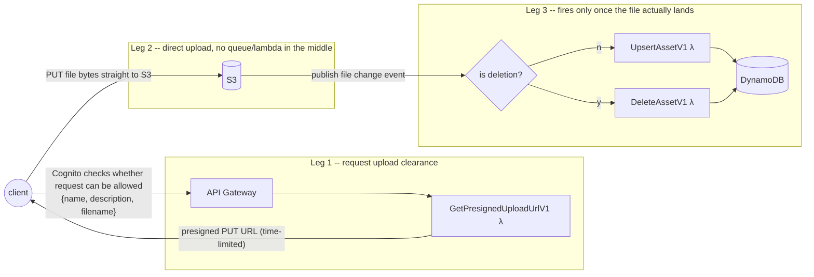

## v2 — presigned URL upload (file bytes never pass through our infra)

Notes on v2:
- **Leg 1** is metadata-only — no file bytes cross API Gateway, SQS, or any Lambda. `GetPresignedUploadUrlV1` calls S3's SDK to mint a presigned PUT URL for a specific key and returns it to the client.
- **Leg 2** is the client talking directly to S3 with that URL. Nothing of ours sits in this path — no size ceilings from API Gateway/SQS/Lambda apply here.
- **Leg 3** is unchanged from v1's tail end, but note the trigger: it only fires when the file actually finishes uploading, which can be any amount of time after leg 1 completed (or never, if the client discards the URL).
- SQS is dropped from the upload path entirely in this version — each file lands in S3 independently and fires its own event, so there's nothing left to queue on the "get clearance" leg. It could still reappear between S3's event and `UpsertAssetV1`/`DeleteAssetV1` in leg 3 if retry/backpressure is wanted there, but that's a different role than v1's SQS.
