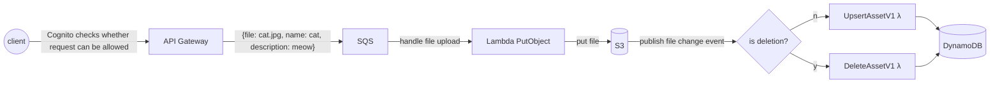
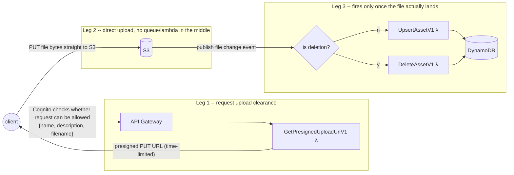
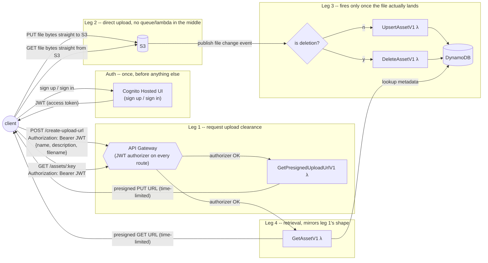
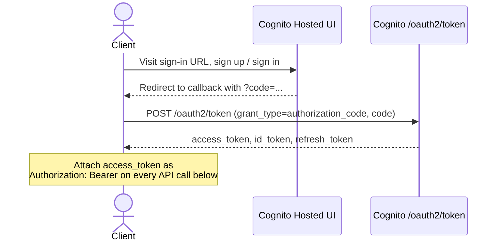
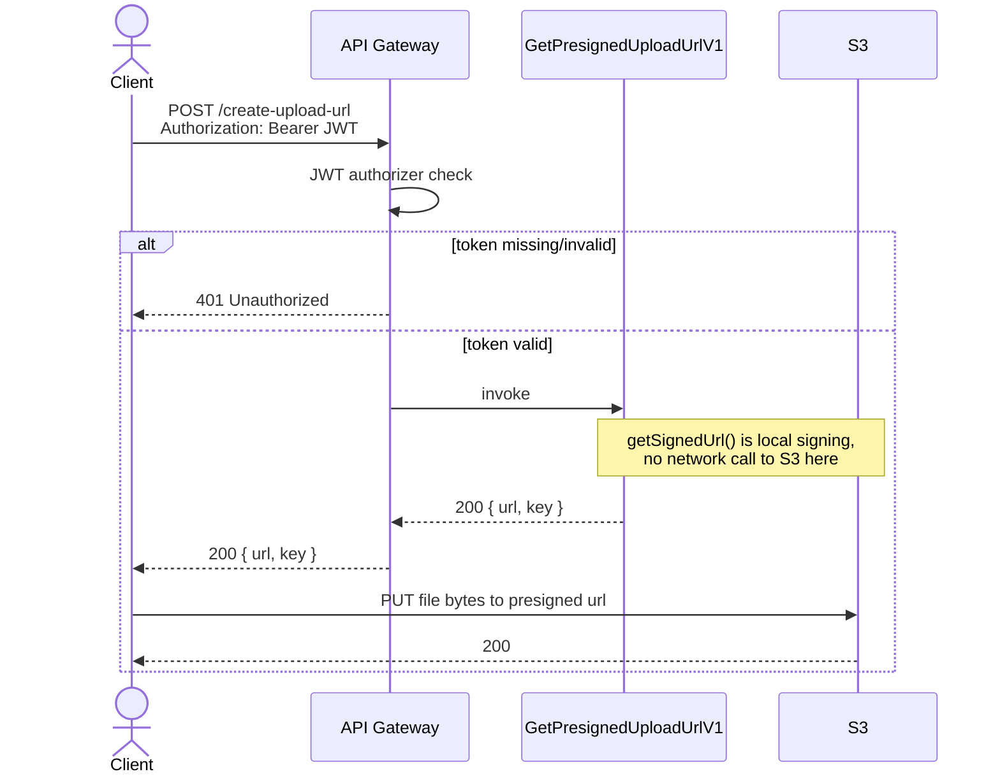
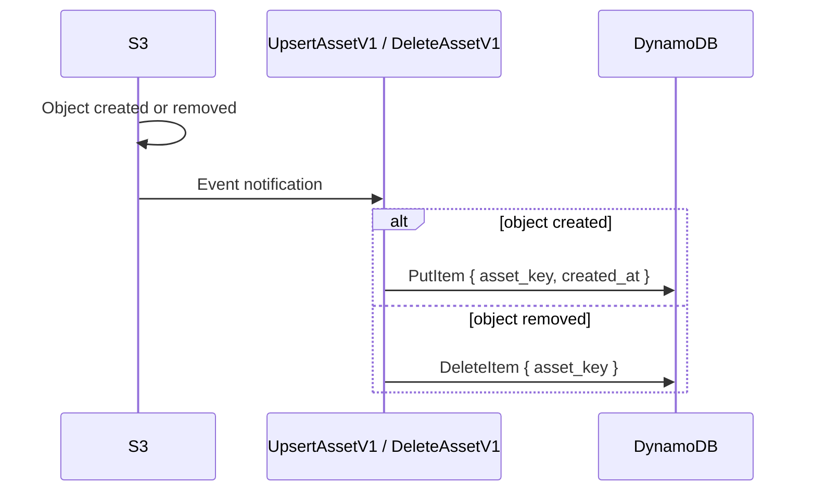
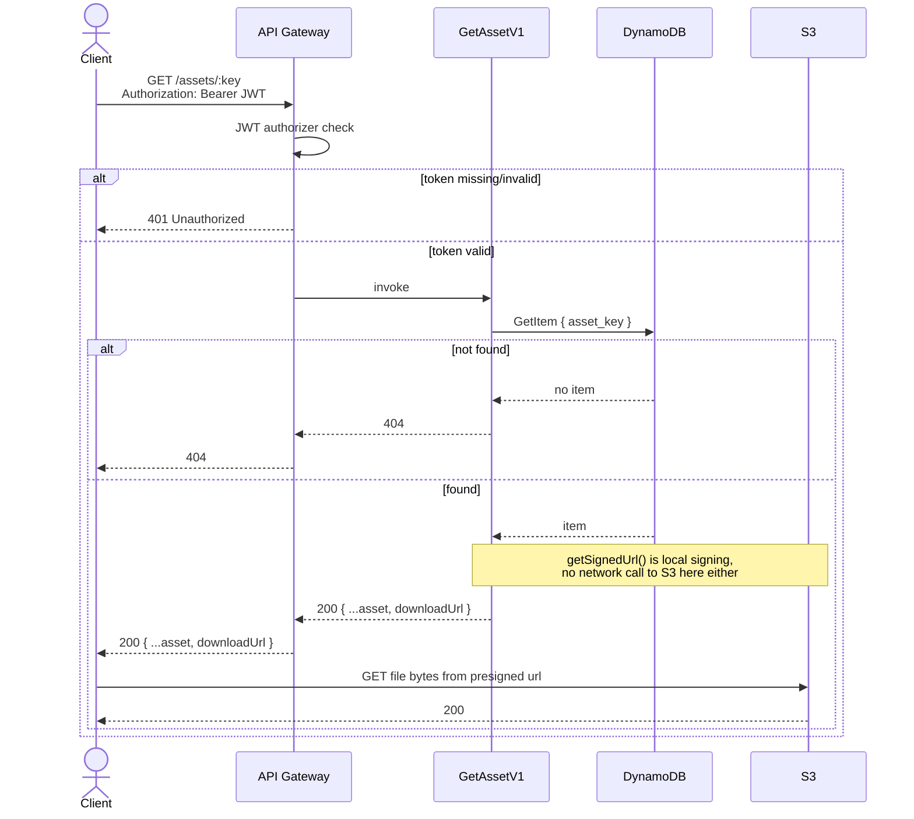

## v2 — presigned URL upload (file bytes never pass through our infra)

Notes on v2:
- **Leg 1** is metadata-only — no file bytes cross API Gateway, SQS, or any Lambda. `GetPresignedUploadUrlV1` calls S3's SDK to mint a presigned PUT URL for a specific key and returns it to the client.
- **Leg 2** is the client talking directly to S3 with that URL. Nothing of ours sits in this path — no size ceilings from API Gateway/SQS/Lambda apply here.
- **Leg 3** is unchanged from v1's tail end, but note the trigger: it only fires when the file actually finishes uploading, which can be any amount of time after leg 1 completed (or never, if the client discards the URL).
- SQS is dropped from the upload path entirely in this version — each file lands in S3 independently and fires its own event, so there's nothing left to queue on the "get clearance" leg. It could still reappear between S3's event and `UpsertAssetV1`/`DeleteAssetV1` in leg 3 if retry/backpressure is wanted there, but that's a different role than v1's SQS.

## v3 — Cognito auth + retrieval added

Notes on v3:
- **Auth is a separate step, not baked into "request clearance" anymore.** v1/v2 hand-waved this as "Cognito checks whether request can be allowed" on the arrow into API Gateway. In reality it's two distinct things: a client signs in *once* via Cognito's Hosted UI to get a JWT, then attaches that JWT to every subsequent API call — API Gateway's JWT authorizer checks it on each request, independent of the Hosted UI itself.
- **The authorizer sits in front of every route**, not just the upload one — shown as a single gate (`defaultAuthorizer` on the `HttpApi`) rather than duplicating the check per leg. A request with a missing/invalid/expired JWT never reaches a Lambda at all — it's rejected `401` at the gate.
- **Leg 4 (retrieval) mirrors leg 1's shape on purpose:** both mint a short-lived presigned S3 URL (PUT for upload, GET for download) and hand it to the client rather than proxying file bytes through Lambda — same reasoning, same size-limit avoidance, opposite direction.
- **DynamoDB now serves two roles**, not one: it's still kept in sync by leg 3 (the S3-event-reactive `UpsertAssetV1`/`DeleteAssetV1`), and it's now also read by leg 4 to look up metadata and (eventually) verify the requesting user owns the asset before minting a download URL.
- SQS remains dropped, same reasoning as v2.

### v3, as sequence diagrams (one per feature)

The flowchart above shows how the pieces connect; these show the actual order of calls and who's waiting on whom — useful for spotting things like "the presigned URL is signed locally, no network round-trip to S3 happens at that step."

**Auth**

**Upload**

**Sync** (reactive — no client involved)

**Retrieval**

